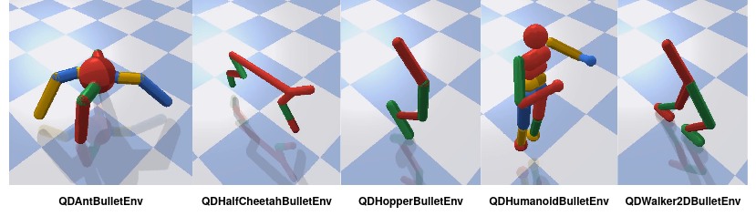

# Intro

QDgym is a framework for Quality Diversity (QD) Optimization benchmarks. It is built on [OpenAI Gym](https://github.com/openai/gym) and uses the same interface. QDgym is meant to unify benchmarks for QD Optimization algorithms and provide a common interface that allows comparisons between QD and standard Deep Reinforcement Learning algorithms.

For those new to QD Optimization, here are three exellent introductory papers in no particular order:

+ [Quality Diversity: A New Frontier for Evolutionary Computation](http://eplex.cs.ucf.edu/papers/pugh_frontiers16.pdf)
+ [Confronting the Challenge of Quality Diversity](https://eplex.cs.ucf.edu/papers/pugh_gecco15.pdf)
+ [Quality and Diversity Optimization: A Unifying Modular Framework](https://arxiv.org/pdf/1708.09251.pdf)

Also checkout: [https://quality-diversity.github.io/]()

## Future Plans
The current version is a v0.1 with a limited number of tasks implemeted. The plan is that as work on and evaluation of the [MAP-Elites GAPG](https://github.com/ollenilsson19/MAP-Elites-GAPG) algorithm progresses, new tasks implemeted for this evaluation will be added to QDgym. Beyond this, the plan is to add any new tasks developed as part of my research in QD Optimization. If the interest in a unified framework for QD benchmarks from the research community is significant, I will make an effort to keep QDgym as complete as possible with respect to tasks used across QD research. 

Contributions welcome!

# Tasks

Currently five tasks are implemented that build on [PyBullet](https://github.com/bulletphysics/bullet3/tree/master/examples/pybullet) robotic locomotion benchmarks where the task is to discover diverse ways to walk (Diversity aspect), where for each type of walk find the fastest walk (Quality aspect).

+ Behaviour Descriptor (BD): Proportion of contact time each foot has with the ground over a walk. The BD in the QDAnt task is thus 4-D while QDHalfCheetah, QDHumanoid and QDWalker have 2-D BDs. The BD for QDHopper is 1-D.
+ Fitness: Walking distance over 1000 simulation steps/walking speed.


<p align="center">

</p>


### Task Details
+ Observations: The robots current COG height, x, y and z velocity, roll, pitch
and yaw angles and the relative position of the robots joints.
    + QDWalker2DBulletEnv-v0: 22-dimensions.
    + QDHalfCheetahBulletEnv-v0: 26-dimensions.
    + QDAntBulletEnv-v0: 28-dimensions.
    + QDHopperBulletEnv-v0: 15-dimensions.
    + QDHumanoidBulletEnv-v0: 44-dimantions
+ Action: The torque to apply to each joint.
    + QDWalker2DBulletEnv-v0: 6-dimensions.
    + QDHalfCheetah: 6-dimensions.
    + QDAntBulletEnv-v0: 8-dimensions.
    + QDHopperBulletEnv-v0: 3-dimensions.
    + QDHumanoidBulletEnv-v0: 17-dimentions.
+ Behavioural Descriptor: The time proportion each foot of the robot is in contact with the ground (scaled to range from 0 to 1).
    + QDWalker2DBulletEnv-v0: 2-dimensions.
    + QDHalfCheetahBulletEnv-v0: 2-dimensions.
    + QDAntBulletEnv-v0: 4-dimensions.
    + QDHopperBulletEnv-v0: 1-dimension.
    + QDHumanoidBulletEnv-v0: 2-dimensions.


# Installation and Use

Installation is easy with pip. Just do:

```
pip3 install git+https://github.com/ollenilsson19/QDgym.git#egg=QDgym
```

this will also automatically install the dependencies requred (gym, pybullet, numpy).

To run tasks with QDgym follow the below structure: 

``` python
# imports
import gym
import QDgym

# make environment
env = gym.make(env_name)
# reset environment
state = env.reset()
done = False
# eval loop
while not done: 
    action = actor.select_action(state)
    state, reward, done, _ = env.step(action) 
# get fitness and BD
fitness = env.tot_reward
behaviour_descriptor = env.desc
# close environment
env.close()
```

The above example assumes there is a defined contoller `actor` with a method `select_action` that for a given input (state) outputs the desired action. Replace `env_name` with your desired task (QDWalker2DBulletEnv-v0, QDHalfCheetahBulletEnv-v0, QDAntBulletEnv-v0, QDHopperBulletEnv-v0, QDHumanoidBulletEnv-v0).

For more detailed example use see `main.py` and `vectorized_env.py` in the [MAP-Elites GAPG implemetation](https://github.com/ollenilsson19/MAP-Elites-GAPG).

